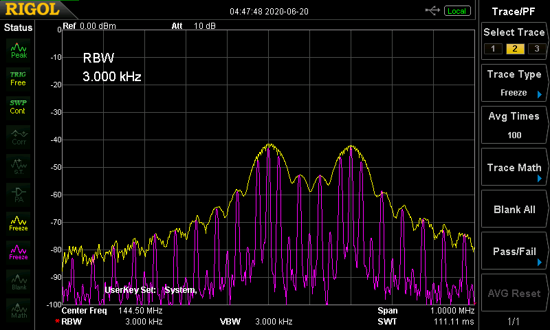

# Pi Radio IP

Minimal hardware IP over VHF/UHF Radio using RpiTx and RTLSDRs [1].



# Project Plan and Status

The software currently sends test frames from a Pi to a x86 laptop with a RTLSDR V3 (M1).  Currently building up an integrated rtl_sdr/fsk_demod receiver appplication (M2).

| Milestone | Description |
| --- | --- |
| M1 | Proof of Concept Physical Layer |
| M2 | Git repo for project, integrated tx and rx applications, first OTA tests |
| M3 | Pi running Tx and Rx |
| M4 | Add LDPC FEC to waveform |
| M5 | Bidirectional half duplex Tx/Rx on single Pi |
| M6 | TAP/TUN integration and demo IP link |
| M7 | Diagostics that can be used to tune and debug link (e.g. simple GUI/ASCII) |
| M8 | Document how to build simple wire antennas |

# Building

This procedure builds everything locally, so won't interfere with any installed versions of the same software.

## RpiTx Transmitter

ssh into your Pi, then:
```
$ git clone https://github.com:drowe67/pirip.git
$ cd pirip
$ ./build_codec2.sh
$ ./build_rpitx.sh
$ cd tx && make
```

## RTLSDR Receiver

On your laptop/PC:
```
$ sudo apt update
$ sudo apt install libusb-1.0-0-dev git cmake
$ ./build_codec2.sh
$ ./build_rtlsdr.sh
```

# Testing

1. Transmit two tone test signal for Pi:
   ```
   pi@raspberrypi:~/pirip/tx $ sudo ./fsk_rpitx -t /dev/null
   ```
1. Transmit test frames from Pi for 60 seconds:
   ```
   pi@raspberrypi:~/pirip/tx $ ../codec2/build_linux/src/fsk_get_test_bits - 600000 | sudo ./fsk_rpitx -
   ```
1. Receive test frames on x86 laptop for 5 seconds (vanilla rtl_sdr):
   ```
   ~/pirip$ Fs=240000; tsecs=5; rtl-sdr-blog/build_rtlsdr/src/rtl_sdr -g 1 -s $Fs -f 144500000 - -n $(($Fs*$tsecs)) | codec2/build_linux/src/fsk_demod -d -p 24 2 240000 10000 - - | codec2/build_linux/src/fsk_put_test_bits -
   ```
1. Receive test frames on x86 laptop for 5 seconds (integrated rtl_fsk):
   ```
   Fs=240000; tsecs=5; ./rtl-sdr-blog/build_rtlsdr/src/rtl_fsk -g 1 -f 144490000 - -n $(($Fs*$tsecs)) | codec2/build_linux/src/fsk_put_test_bits -
   ```
   Note this is tuned about 10kHz low, to put the two tones above the rtl_sdr DC line.  
1. Sample received signal and inspect using Octave:
   ```
   TODO
   ```
   
# Reading Further

1. [Open IP over VHF/UHF](http://www.rowetel.com/?p=7207) - Blog post introducing this project
1. [Codec 2 FSK Modem](https://github.com/drowe67/codec2/blob/master/README_fsk.md)
1. [RpiTx](https://github.com/F5OEO/rpitx) - Radio transmitter software for Raspberry Pis
1. [rtlsdr driver](https://github.com/rtlsdrblog/rtl-sdr-blog) - Modified Osmocom drivers with enhancements for RTL-SDR Blog V3 units. 
